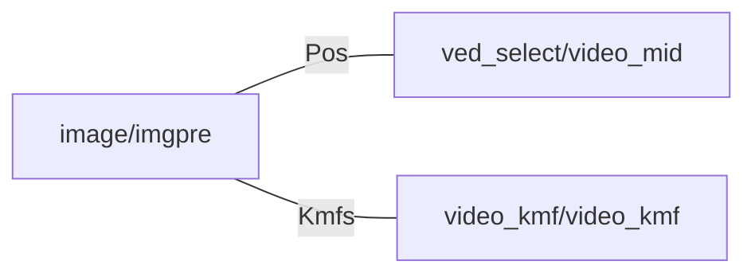

## 节点流程图 


## 程序流程图
```mermaid
graph TD
 image/imgpre---读取视频---读取一帧
 读取一帧---畸变矫正/灰度图/二值化/膨胀
 畸变矫正/灰度图/二值化/膨胀---findcontours(寻找轮廓)---筛出灯条
 筛出灯条---灯条匹配
 灯条匹配---找出最大可匹配的目标---画框
 找出最大可匹配的目标---发布数据
 发布数据---|Pos|ved_select---恢复目标的相机坐标---根据F=P*D/W求出距离---solvepnp
 solvepnp---求出欧拉角---发布
 发布数据---|Kmfs|video_kmf/video_kmf---初始化参数---处理订阅数据---求出X和P
 求出X和P---求出卡尔曼系数K---更新X和P---输出预测坐标---发布坐标
```


### 最后说点 刚开始看到题目的时候想得是先单独一个文件里实现识别的部分，调整好了以后在挪到ros2框架下，image里imgpre的构造函数基本就是刚开始写的那个文件全盘cv进来的，但后续就发现这样做的不好了：我弄了个卡尔曼滤波向把滤波后的坐标发布给imgpre最后在视频里同时框出识别的和卡尔曼预测的，但好像是线程的原因imgpre里的订阅回调函数到了视频播放结束后才执行。如果要重新写我大概会把image删了全部重写。
### ved_select和video_kmf里的CMakeLists.txt都是用的ament_cmake_auto，image保持原样没动，video_interfaces里我是想写的，但rosidl_generate_interfaces的ament_cmake_auto的替代ament_auto_generate看了看源代码好像还没实现，就也用原来的方式写了。
### 本来还想继续跟这题磕一磕的，但连着几周全天敲电脑搞得我肩膀脖子特别疼，不得不停几天休息下，所以就先这样交了吧。感觉这题我必挂，这结果我都看不下去，根据视频末尾那个白车撞过来那段输出的姿态，距离啥的来看我姿态解算那部分应该没啥大问题，感觉还是识别那段问题大了。
### 在此之前完成了考核题B，写这个的同时还在学习考核题D的东西，感觉还是这题带来的收获更大一些，起码我真的会用opencv了。此致，提前两周多祝新年快乐，有空了我在奔奔其他考核题，争取下学期能入队。